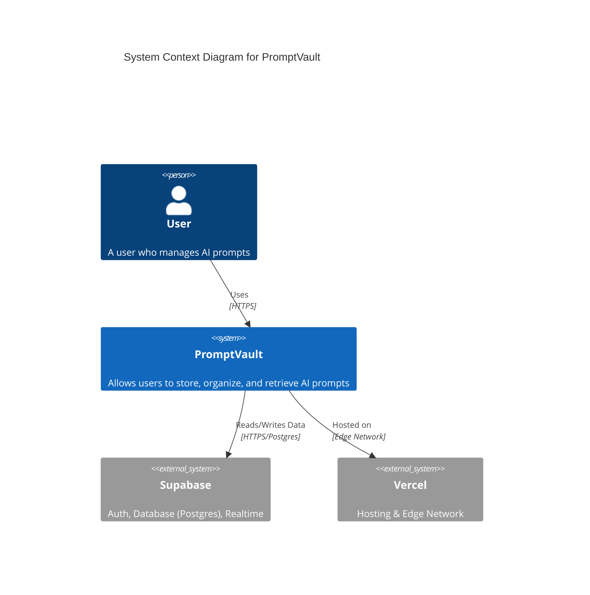

# 项目架构 (Architecture)

PromptVault 采用了现代化的全栈 TypeScript 架构，旨在提供高性能、类型安全且易于维护的开发体验。

## 系统上下文 (System Context)

以下是 PromptVault 的 C4 System Context 图，展示了用户与系统及其外部依赖的关系。



## 核心技术栈 (Tech Stack)

### 1. 核心框架 (Core Framework)
*   **Next.js 15 (App Router)**:
    *   **架构**: 采用 App Router，利用 React Server Components (RSC) 默认在服务端渲染，减少客户端 Bundle 体积。
    *   **Turbopack**: 开发环境使用 Turbopack (`next dev --turbopack`)，提供毫秒级的热更新 (HMR)。
    *   **Streaming**: 利用 React Suspense 实现流式渲染，优先展示 UI 骨架屏，逐步加载数据。
*   **React 19**:
    *   **Server Actions**: 直接在 Server Component 中定义异步函数处理表单提交，替代了传统的 API Route 模式，简化了数据变更逻辑。
    *   **useOptimistic**: 配合 Server Actions 实现乐观 UI 更新，提升用户感知的响应速度。
    *   **Compiler**: React 19 的编译器自动优化重渲染，减少了 `useMemo` 和 `useCallback` 的手动使用需求。

### 2. 编程语言 (Language)
*   **TypeScript 5.x**: 全项目采用严格模式 (Strict Mode)。
    *   **End-to-End Type Safety**: 从数据库 Schema (Supabase) 到 后端 API (tRPC) 再到 前端组件，类型完全打通。修改数据库字段，前端会自动报错。

### 3. 后端与 API (Backend & API)
*   **tRPC v11**:
    *   **Native TanStack Query Integration**: v11 版本移除了旧版 API，深度集成 TanStack Query，提供了更符合直觉的 `queryOptions` 和 `mutationOptions`。
    *   **Type Inference**: 无需代码生成 (Codegen)，直接推导后端 Router 类型。
    *   **Middleware**: 使用 tRPC 中间件处理权限验证 (Protected Procedures)。
*   **Supabase (BaaS)**:
    *   **PostgreSQL**: 核心数据库，支持复杂的 SQL 查询和 JSONB 数据类型（适合存储灵活的 Prompt 结构）。
    *   **Auth (GoTrue)**: 提供基于 JWT 的无状态认证，支持 OAuth (GitHub) 和 邮箱/密码登录。
    *   **Row Level Security (RLS)**: 安全策略下沉至数据库层。例如 `auth.uid() = user_id` 策略确保用户只能访问自己的数据。
    *   **@supabase/ssr**: 专门适配 Next.js 的 SSR 库，处理 Cookie 的读写（Server Component 只读，Server Action/Route Handler 可写）。

### 4. 前端与状态管理 (Frontend & State)
*   **TanStack Query v5**:
    *   **Server-Side Prefetching**: 在 Server Component 中预取数据，通过 `HydrationBoundary` 传递给客户端，实现首屏即有数据 (No Loading Spinner)。
    *   **Stale-While-Revalidate**: 智能缓存策略，后台静默更新数据。
*   **Tailwind CSS 3.4**:
    *   **JIT Engine**: 按需生成 CSS，生产环境 CSS 文件极小。
    *   **Configuration**: 通过 `tailwind.config.ts` 自定义颜色系统（CSS 变量）以支持暗色模式。
*   **shadcn/ui**:
    *   **Philosophy**: 不是 npm 包，而是复制代码。拥有代码的完全控制权。
    *   **Radix UI**: 底层使用 Radix UI 无头组件，保证无障碍访问 (A11y) 和键盘导航支持。
*   **Lucide React**: 统一的 SVG 图标库，支持 Tree Shaking。

### 5. 工具链 (Tooling)
*   **Biome**:
    *   **Performance**: 基于 Rust 编写，比 ESLint + Prettier 快 30 倍以上。
    *   **Unified**: 统一了 Linting 和 Formatting，避免了规则冲突。
*   **Vitest**:
    *   **Vite Native**: 复用 Vite 配置（路径别名等），无需额外配置 Jest。
    *   **Watch Mode**: 极速的监听模式，适合 TDD 开发。
*   **pnpm**:
    *   **Symlinks**: 使用软链接管理依赖，极大节省磁盘空间并提升安装速度。

---

## 目录结构 (Project Structure)

```
src/
├── app/                    # Next.js App Router 页面
│   ├── api/trpc/           # tRPC API 端点 (Route Handler)
│   ├── auth/               # 认证相关页面 (Callback 处理)
│   ├── dashboard/          # 受保护的仪表盘页面 (Server Components)
│   ├── login/              # 登录页面
│   ├── layout.tsx          # 根布局 (包含 Providers)
│   └── page.tsx            # 落地页
├── components/             # React 组件
│   ├── providers/          # 全局 Context Providers (QueryClient, TRPCClient)
│   └── ui/                 # shadcn/ui 组件 (Button, Input, Dialog 等)
├── lib/                    # 核心库与工具
│   ├── supabase/           # Supabase 客户端配置 (Browser, Server, Middleware)
│   ├── env.ts              # 环境变量 Zod 验证
│   ├── query-client.ts     # QueryClient 全局配置 (StaleTime 等)
│   └── utils.ts            # 通用辅助函数 (cn, date formatting)
├── server/                 # 服务端逻辑
│   └── trpc/               # tRPC 核心配置
│       ├── routers/        # API 路由定义 (PromptRouter, TagRouter)
│       ├── client.ts       # 客户端 tRPC 实例 (CreateTRPCContext)
│       ├── init.ts         # tRPC 初始化 (Context, Middlewares, Procedures)
│       └── server.ts       # 服务端 Caller (Server Components 直接调用)
└── middleware.ts           # Next.js 中间件 (Auth Redirects & Session Refresh)
```
