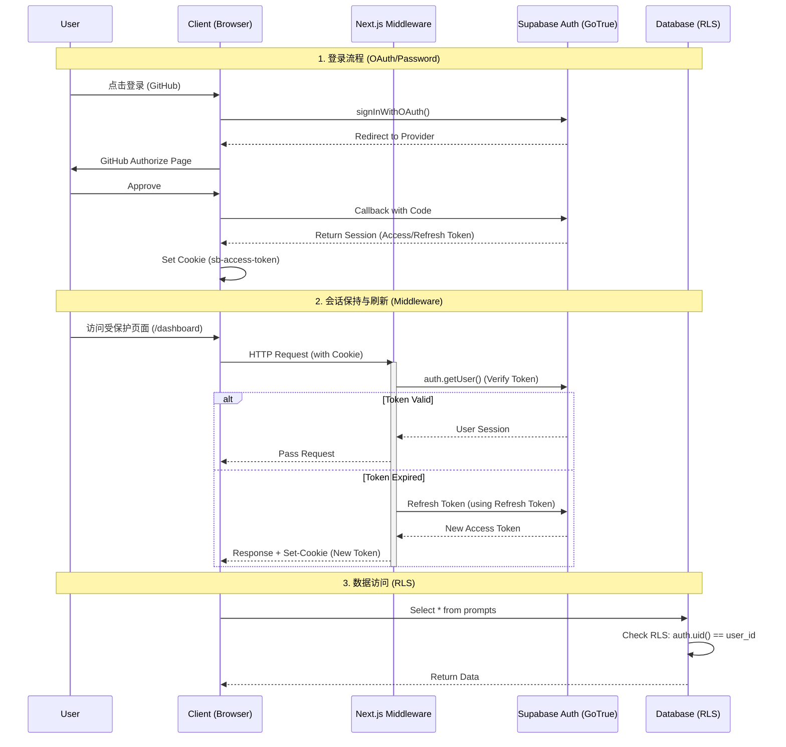

# 认证架构 (Authentication Architecture)

认证是全栈应用中最复杂的部分之一。本项目利用 **Supabase Auth** 和 **Next.js Middleware** 实现了一套安全、无缝的认证流程。

## 认证流程图 (Authentication Flows)

以下是用户登录、会话维持和登出的完整时序图。



## 关键技术点

### 1. PKCE 流程 (Proof Key for Code Exchange)
我们在服务端认证（SSR）中强制使用 PKCE 流程。
*   **安全性**: 防止授权码拦截攻击。
*   **机制**: 在重定向登录时生成一个 code_verifier，在回调时验证这个 verifier。`@supabase/ssr` 库自动处理这一切。

### 2. Middleware 的核心作用
文件：`src/middleware.ts` & `src/lib/supabase/middleware.ts`

Middleware 在 Next.js 中极其关键，因为它运行在任何页面渲染之前。
*   **Session 刷新**: Supabase 的 Access Token 有效期较短（通常 1 小时）。Middleware 负责检查 Token 是否快过期。如果是，它会调用 Supabase 刷新 Token，并通过 `Set-Cookie` Header 将新 Token 发回浏览器。
    *   **注意**: 必须将 `response` 对象传递回 Next.js 流程，否则新 Cookie 会丢失，导致用户每小时被登出一次。
*   **路由守卫**:
    *   **白名单**: `login`, `auth/*`, `static files`。
    *   **黑名单**: `dashboard`, `prompts`。
    *   如果未登录访问黑名单 -> Redirect to `/login`。
    *   如果已登录访问 `/login` -> Redirect to `/dashboard`。

### 3. 多端 Supabase Client

我们根据运行环境不同，封装了三种 Supabase Client：

| Client 类型 | 文件路径 | 用途 | 关键特性 |
| :--- | :--- | :--- | :--- |
| **Browser Client** | `lib/supabase/client.ts` | 客户端组件 (`useEffect`, Event Handlers) | 单例模式，自动读取浏览器 Cookie。 |
| **Server Client** | `lib/supabase/server.ts` | Server Components, Server Actions, Route Handlers | **只读/读写分离**。在 Server Component 中无法设置 Cookie，只能读取。在 Actions 中可以设置。 |
| **Middleware Client** | `lib/supabase/middleware.ts` | `middleware.ts` | 专门处理 Request/Response 对象的 Cookie 读写。 |

### 4. 数据安全 (Row Level Security)

这是最后一道防线。即便黑客窃取了 Anon Key（这是公开的），也无法绕过 RLS。
*   **`auth.uid()`**: Supabase 提供的一个特殊 SQL 函数，返回当前 JWT 解析出的 User ID。
*   **策略**:
    ```sql
    CREATE POLICY "Enable insert for authenticated users only"
    ON "public"."prompts"
    AS PERMISSIVE FOR INSERT
    TO authenticated
    WITH CHECK ((auth.uid() = user_id));
    ```
    这条策略保证了用户创建数据时，`user_id` 字段必须等于他们自己的 ID。
