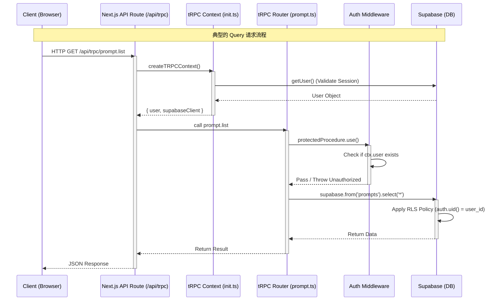
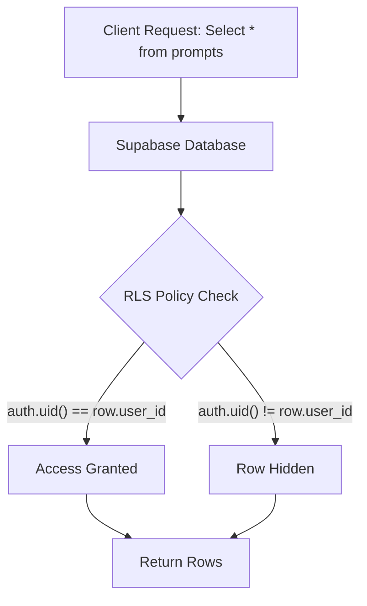

# 后端架构 (Backend Architecture)

PromptVault 后端架构基于 **tRPC v11** 和 **Supabase** 构建，充分利用了 Serverless 和 Edge 的优势。

## tRPC 请求生命周期 (Request Lifecycle)

下面的时序图展示了一个典型的 tRPC 请求（例如：获取 Prompt 列表）是如何在系统中流转的。



## tRPC v11 深度解析

本项目使用的是 tRPC v11，它带来了显著的架构改进。

### 1. 初始化与上下文 (Initialization & Context)
文件：`src/server/trpc/init.ts`

*   **Context Isolation**: 每个请求都会生成独立的 Context。
    *   **Supabase Client**: 我们在 Context 中初始化 Supabase Server Client。这至关重要，因为它会自动解析请求中的 Cookie，确保后续数据库操作能正确识别当前用户。
    *   **Performance**: `getUser()` 调用在 Context 创建时发生。虽然这增加了一次 Supabase Auth API 调用，但为了安全性（验证 Token 签名和有效期），这是必要的。

### 2. 路由 (Routers) 与 过程 (Procedures)
文件：`src/server/trpc/routers/`

*   **Builder Pattern**: 使用 `t.router` 和 `t.procedure` 构建 API。
*   **Input Validation**: 结合 `zod` 库进行运行时参数验证。
    ```typescript
    // 示例：创建 Prompt
    create: protectedProcedure
      .input(z.object({
        title: z.string().min(1),
        content: z.string(),
      }))
      .mutation(async ({ ctx, input }) => {
        // ...
      })
    ```
*   **Error Handling**: 使用 `TRPCError` 抛出标准 HTTP 错误（如 `BAD_REQUEST`, `UNAUTHORIZED`），前端会自动捕获并处理。

### 3. Server-Side Callers
文件：`src/server/trpc/server.ts`

在 Next.js Server Components 中，我们不需要发送 HTTP 请求，而是直接调用后端函数。tRPC 提供了 `createCaller` 来实现这一点。
*   **Zero Latency**: 直接在服务器内部执行函数，没有网络开销。
*   **Reusability**: 前端组件（通过 HTTP）和 服务端组件（直接调用）复用同一套 Router 逻辑。

## Supabase 数据库与安全

### 1. 数据库模式 (Database Schema)

虽然 Supabase 是 Schemaless 的 JSON 友好型数据库，但我们主要使用其关系型特性 (PostgreSQL)。

主要表结构示例：
*   **profiles**: 存储用户信息（关联 `auth.users`）。
*   **prompts**: 存储 Prompt 数据。
    *   `id`: UUID
    *   `user_id`: UUID (Foreign Key -> auth.users)
    *   `title`: Text
    *   `content`: Text (支持 Markdown)
    *   `variables`: JSONB (存储模板变量 `{{var}}`)

### 2. Row Level Security (RLS)

RLS 是 Supabase 安全模型的核心。我们不依赖应用层代码（如 `where user_id = current_user`）来过滤数据，而是强制在数据库层执行。

**RLS 策略示例图解：**



这意味着即使开发者在后端代码中忘记写 `.eq('user_id', user.id)`，数据也不会泄露。

### 3. @supabase/ssr

在 Next.js 环境中，Cookie 管理很复杂。`@supabase/ssr` 解决了以下问题：
*   **Browser**: 自动处理 `localStorage` 到 Cookie 的迁移。
*   **Server Component**: 只读 Cookie（因为 RSC 在响应流开始后无法设置 Header）。
*   **Middleware**: 拦截请求，刷新即将过期的 Token，并写入 Response Cookie。
*   **Server Action / Route Handler**: 可以读写 Cookie，用于登录、注册等操作。
